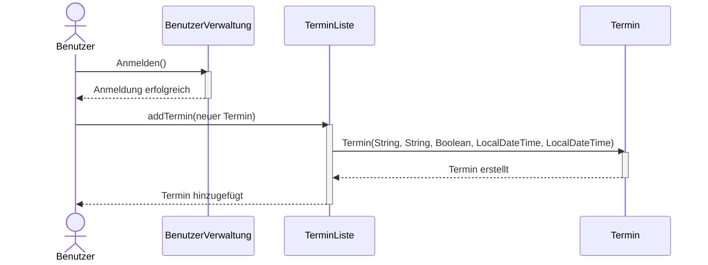

```mermaid
sequenceDiagram
    actor Benutzer
    participant BenutzerVerwaltung
    participant TerminListe
    participant Termin

    Benutzer->>BenutzerVerwaltung: Anmelden()
    activate BenutzerVerwaltung
    BenutzerVerwaltung-->>Benutzer: Anmeldung erfolgreich
    deactivate BenutzerVerwaltung

    Benutzer->>TerminListe: addTermin(neuer Termin)
    activate TerminListe
    TerminListe->>Termin: Termin(String, String, Boolean, LocalDateTime, LocalDateTime)
    activate Termin
    Termin-->>TerminListe: Termin erstellt
    deactivate Termin
    TerminListe-->>Benutzer: Termin hinzugefügt
    deactivate TerminListe

```