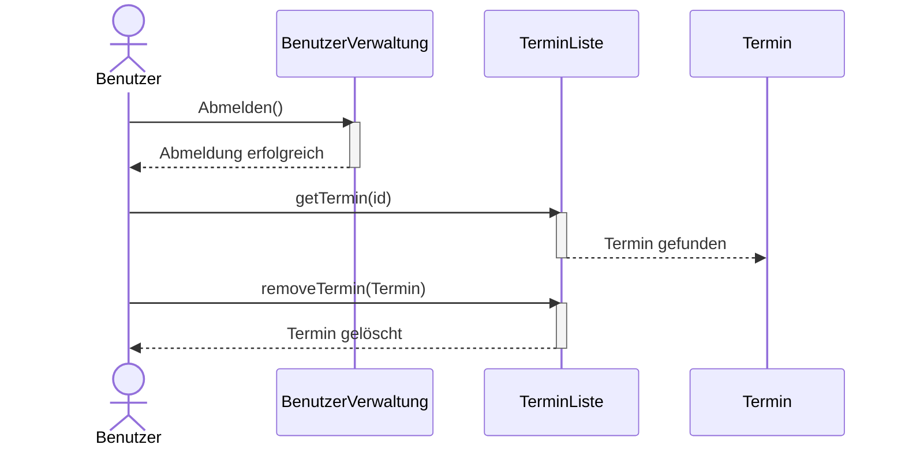

```mermaid
sequenceDiagram
    actor Benutzer
    participant BenutzerVerwaltung
    participant TerminListe
    participant Termin

    Benutzer->>BenutzerVerwaltung: Abmelden()
    activate BenutzerVerwaltung
    BenutzerVerwaltung-->>Benutzer: Abmeldung erfolgreich
    deactivate BenutzerVerwaltung

    Benutzer->>TerminListe: getTermin(id)
    activate TerminListe
    TerminListe-->>Termin: Termin gefunden
    deactivate TerminListe

    Benutzer->>TerminListe: removeTermin(Termin)
    activate TerminListe
    TerminListe-->>Benutzer: Termin gelöscht
    deactivate TerminListe
```