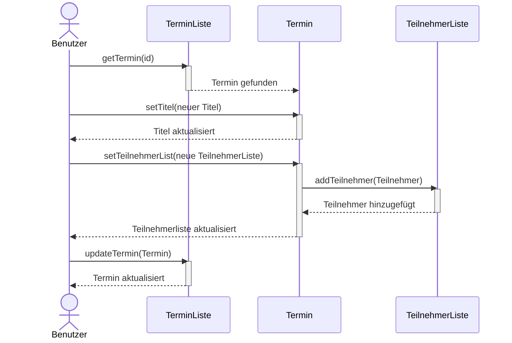

```mermaid
sequenceDiagram
    actor Benutzer
    participant TerminListe
    participant Termin
    participant TeilnehmerListe

    Benutzer->>TerminListe: getTermin(id)
    activate TerminListe
    TerminListe-->>Termin: Termin gefunden
    deactivate TerminListe

    Benutzer->>Termin: setTitel(neuer Titel)
    activate Termin
    Termin-->>Benutzer: Titel aktualisiert
    deactivate Termin

    Benutzer->>Termin: setTeilnehmerList(neue TeilnehmerListe)
    activate Termin
    Termin->>TeilnehmerListe: addTeilnehmer(Teilnehmer)
    activate TeilnehmerListe
    TeilnehmerListe-->>Termin: Teilnehmer hinzugefügt
    deactivate TeilnehmerListe
    Termin-->>Benutzer: Teilnehmerliste aktualisiert
    deactivate Termin

    Benutzer->>TerminListe: updateTermin(Termin)
    activate TerminListe
    TerminListe-->>Benutzer: Termin aktualisiert
    deactivate TerminListe
```