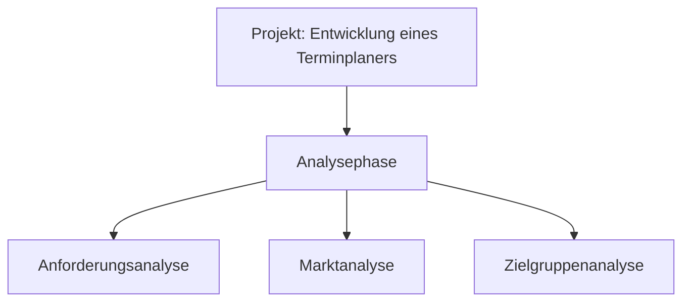

# TimeWise

## Description
https://docs.google.com/document/d/1uNtRR81TT59xqEhV6PYmT0JE1Okxd2mY76Au3XIcCRc/edit#
#### Zielbestimmung: 
Das Ziel ist es, ein Programm zu entwickeln, welches einen digitalen Kalender abbildet. Dieser Kalender kann auf Monat-, Wochen- und Tagesebene betrachtet werden. Es lassen sich Termin minutengenau eintragen und ändern. Zu den Terminen können Datum, Startzeit, Endzeit, Titel, Beschreibung, Ort und Personen eingetragen werden. Des Weiteren sind Feiertage vorgemerkt. Im Kalender ist der aktuelle Tag markiert und es lässt sich zum aktuellen Tag navigieren. Außerdem können Serientermine eingestellt werden.
Wir entscheiden uns für eine agile Durchführung des Projektes. Um sicherzustellen, dass ausreichend Zeit für die Durchführung uns zur Verfügung steht, haben wir uns für eine vorzeitige Deadline für die Projektarbeit bis zum Projektende eingeplant. Somit haben wir einen zeitlichen Puffer, der uns flexibles Handeln ermöglicht.
#### Muss
Kalender, Termine erstellen und anzeigen (ganztägige Termine), Aktueller Tagesanzeiger, Tagesansicht, Wochenansicht, Monatsansicht
#### Kann
kann: Termin Eigenschaften (individuelle Zeitr%C3%A4ume, Wiederholungstermin), Termin Kategorisierung, Ressourcen-Buchung (Raum/Ort, Telefonspinne f. Hybrid, Beamer etc.), Teilnehmer, %C3%9Cbersicht zuk%C3%BCnftiger Termine, ICS Export, Termin per Mail versenden, Feiertage, Terminplaner/planungsassistent, Fahrzeit, Terminerinnerungen (Pop-Up Fenster), Eingabehilfe (bei Eingabe Termin-Titel Vorschlag mit Termin Eigenschaften bereits vorhandener Termine)

## Contributors
- #### Oleksandr Kamenskyi:   
  - Aufgabenbereich: Teamleitung, Systemarchitektur, Git-Management, Dokumentation
- #### Philipp Voß:  
    - Aufgabenbereich: Programmierer, Systemarchitektur, Dokumentation
- #### Tobias Rehm:  
    - Aufgabenbereich: Programmierer, Dokumentation
- #### Simon Degmair:  
    - Aufgabenbereich: Programmierer, Dokumentation
- #### Leif Erik Maluck:  
    - Aufgabenbereich: Programmierer, Dokumentation

####  24.05.2023   Berlin, Germany 

